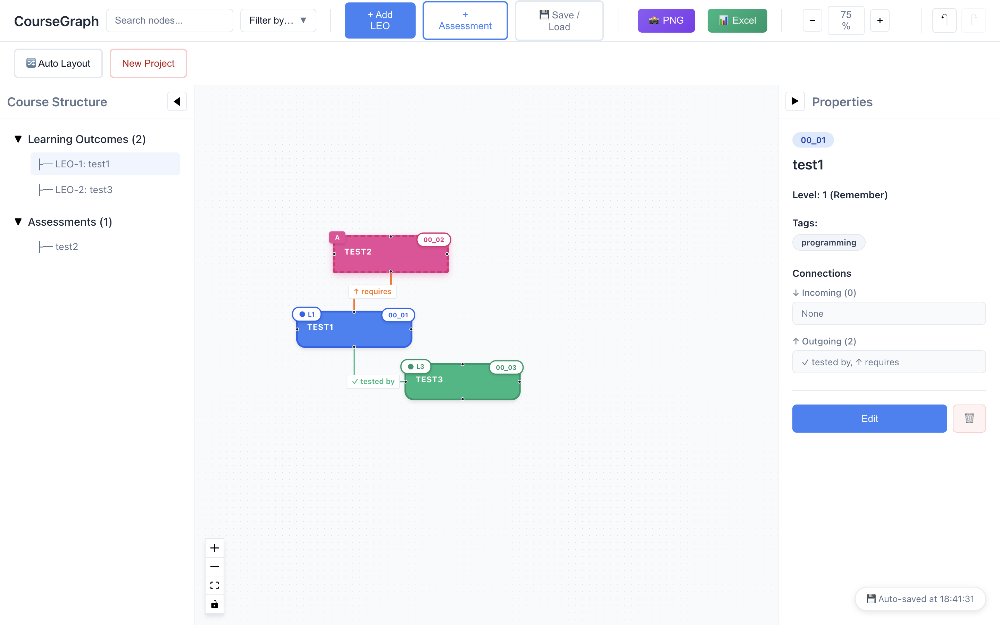
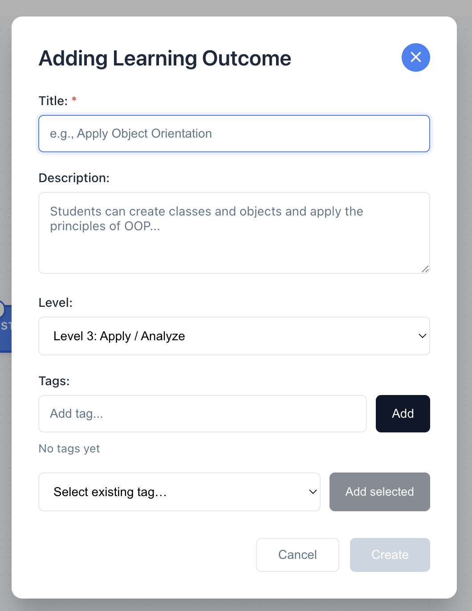
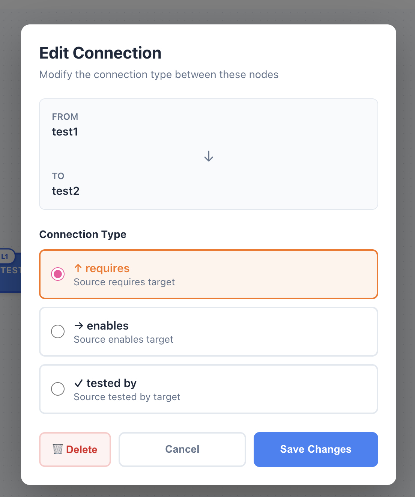
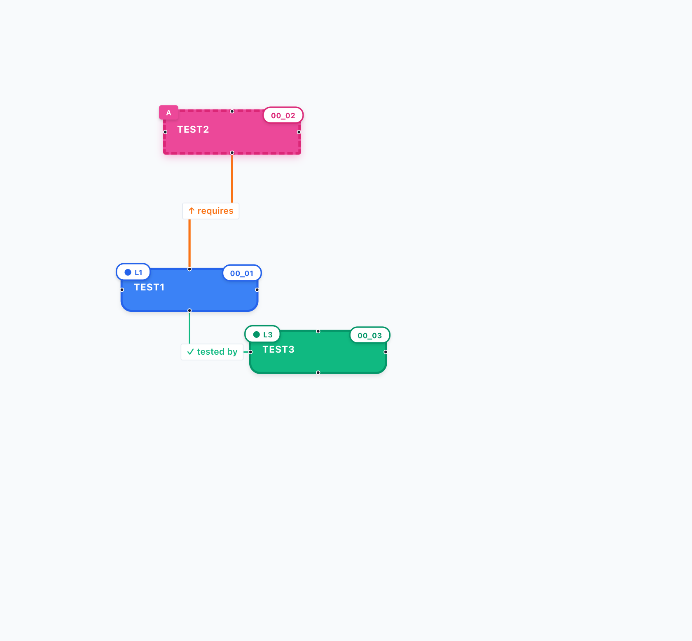
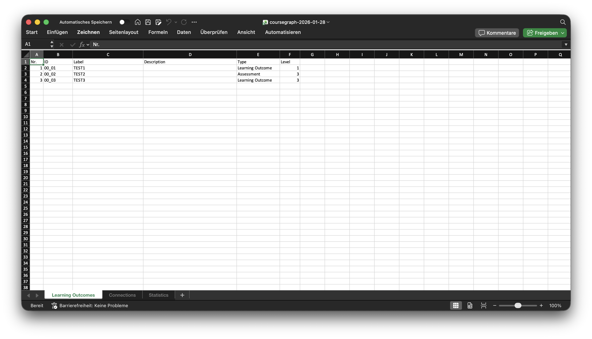
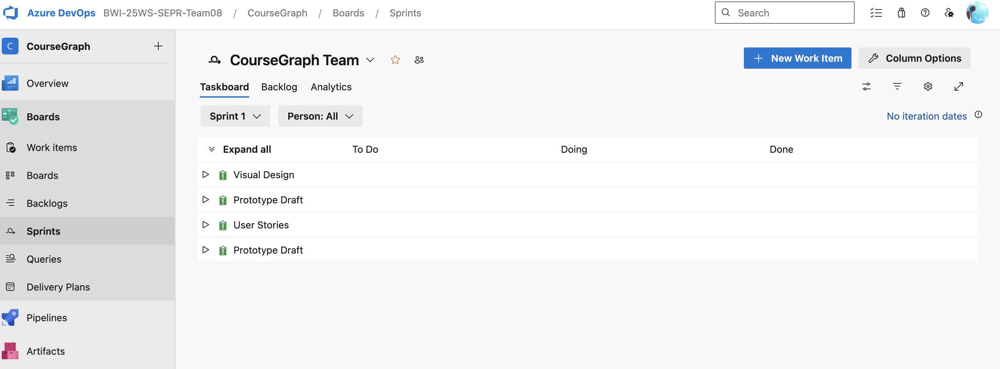
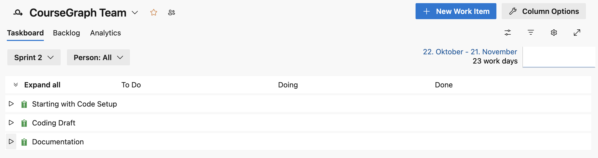
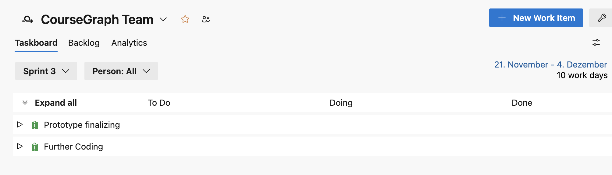
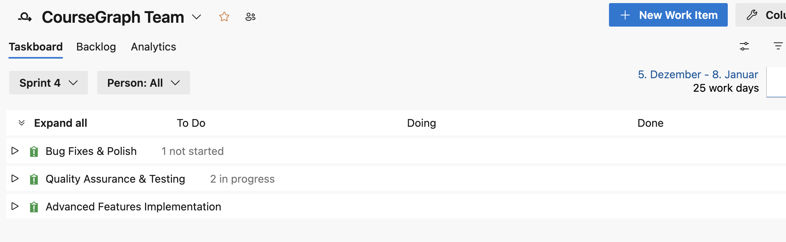
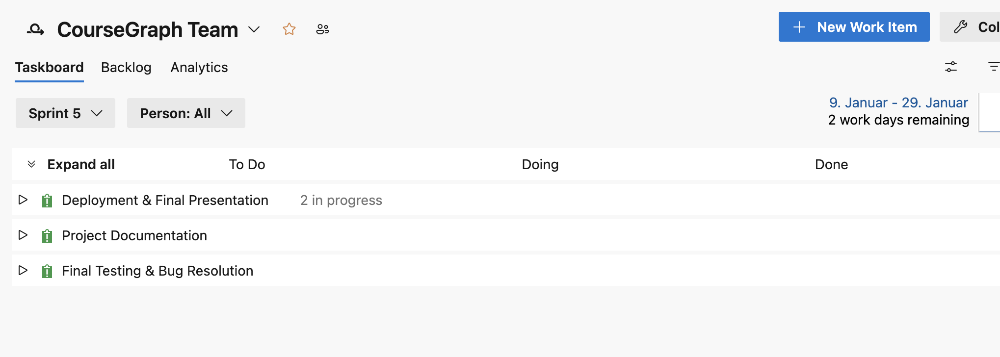

# CourseGraph - Grading Evidence Documentation

**Project:** CourseGraph
**Team:** wi23b162, wi23b165, wi23b128
**Date:** January 2025

---

## Overview

This document provides evidence for all grading criteria as defined in the course requirements.

| Category | Weight | Section |
|----------|--------|---------|
| Planning | 5% | [1. Planning](#1-planning-5) |
| Requirements Engineering | 10% | [2. Requirements Engineering](#2-requirements-engineering-10) |
| Analysis and Design | 5% | [3. Analysis and Design](#3-analysis-and-design-5) |
| Implementation and Testing | 5% | [4. Implementation and Testing](#4-implementation-and-testing-5) |
| Teamwork | 5% | [5. Teamwork](#5-teamwork-5) |
| Project Management | 5% | [6. Project Management](#6-project-management-5) |
| Deployment | 5% | [7. Deployment](#7-deployment-5) |
| **Total Process** | **40%** | |

---

## 1. Planning (5%)

### 1.1 Project Vision

**Vision Statement:**
CourseGraph supports course designers in developing courses following the Constructive Alignment approach. The tool enables the definition of Learning Outcomes (LEOs) and their relationships, linking them to assessments, and visualizing the entire course structure as an interactive graph.

**Target Users:**
- Course designers
- Educators
- Academic staff at universities

### 1.2 Project Scope

**In Scope:**
- Desktop application for Windows, macOS, Linux
- Interactive graph visualization
- Node management (LEO and Assessment)
- Connection management with typed relationships
- Data persistence (auto-save, manual save)
- Export functionality (PNG, Excel)

**Out of Scope:**
- Web application
- Cloud storage
- Multi-user collaboration (future enhancement)
- LMS integration (future enhancement)

### 1.3 Technology Selection

| Decision | Choice | Rationale |
|----------|--------|-----------|
| Platform | Electron | Cross-platform desktop support, web technologies |
| UI Framework | React | Component-based, large ecosystem, team familiarity |
| Graph Library | ReactFlow | Purpose-built for node-based editors, good documentation |
| Build Tool | Vite | Fast HMR, modern bundling, Electron integration |

---

## 2. Requirements Engineering (10%)

### 2.1 Requirements Elicitation Methods

| Method | Description | 
|--------|-------------|
| Stakeholder Interviews | Discussions with course supervisor | 

### 2.2 Functional Requirements

| ID | Requirement | Priority | Status | Evidence |
|----|-------------|----------|--------|----------|
| FR1 | Create and manage LEO nodes | Must Have | Implemented | `AddNodeDialog.jsx`, `CustomNode.jsx` |
| FR2 | Create and manage Assessment nodes | Must Have | Implemented | `AddNodeDialog.jsx`, `CustomNode.jsx` |
| FR3 | Connect nodes with relationships | Must Have | Implemented | `EdgeTypeDialog.jsx`, `edgeUtils.js` |
| FR4 | Three edge types (requires, implies, tests) | Must Have | Implemented | `edgeUtils.js` |
| FR5 | Visual differentiation by node type | Must Have | Implemented | `CustomNode.jsx` |
| FR6 | 5 complexity levels with color coding | Should Have | Implemented | `CustomNode.jsx` |
| FR7 | Auto-save to localStorage | Must Have | Implemented | `Saveloadmanager.jsx` |
| FR8 | Manual save functionality | Should Have | Implemented | `Saveloadmanager.jsx` |
| FR9 | Export to PNG | Must Have | Implemented | `exportUtils.js` |
| FR10 | Export to Excel | Should Have | Implemented | `exportUtils.js` |
| FR11 | Undo/Redo functionality | Should Have | Implemented | `App.jsx` (history state) |
| FR12 | Auto-layout algorithm | Could Have | Implemented | `autoLayout.js` |
| FR13 | Tag management | Could Have | Implemented | `EditNodeDialog.jsx` |
| FR14 | Search and filter nodes | Could Have | Implemented | `App.jsx` |
| FR15 | New project with confirmation | Must Have | Implemented | `NewProjectDialog.jsx` |

### 2.3 Non-Functional Requirements

| ID | Requirement | Metric | Status | Evidence |
|----|-------------|--------|--------|----------|
| NFR1 | Usability | First-time users can create graph in <5 min | Implemented | User testing feedback |
| NFR2 | Performance | 60 FPS with 100+ nodes | Implemented | Performance testing |
| NFR3 | Reliability | No data loss during operations | Implemented | Auto-save, testing |
| NFR4 | Accessibility | Keyboard navigation, high contrast | Implemented | Accessibility improvements commit |

### 2.4 User Stories

**US1 - Create Learning Outcome**
> As a course designer, I want to create a Learning Outcome node so that I can define what students will learn.

**Acceptance Criteria:**
- [x] Can click "Add Node" button
- [x] Can select "Learning Outcome" type
- [x] Can enter label and description
- [x] Can select complexity level
- [x] Node appears on canvas with correct styling

**US2 - Connect Nodes**
> As a course designer, I want to connect nodes with typed relationships so that I can show dependencies between learning outcomes and assessments.

**Acceptance Criteria:**
- [x] Can drag from connection handle
- [x] Can drop on target node
- [x] Can select relationship type
- [x] Connection appears with correct color and label

**US3 - Export Course Structure**
> As a course designer, I want to export my course graph so that I can share it with colleagues or include it in documentation.

**Acceptance Criteria:**
- [x] Can export as PNG image
- [x] Can export as Excel workbook
- [x] Excel includes all node and connection data

### 2.5 Requirements Traceability

| User Story | Requirements | Implementation | Test |
|------------|--------------|----------------|------|
| US1 | FR1, FR5, FR6 | `AddNodeDialog.jsx`, `CustomNode.jsx` | [Test case] |
| US2 | FR3, FR4 | `EdgeTypeDialog.jsx`, `edgeUtils.js` | [Test case] |
| US3 | FR9, FR10 | `exportUtils.js` | [Test case] |

---

## 3. Analysis and Design (5%)

### 3.1 Architecture Overview

**Architecture Pattern:** Desktop Application (Electron + React)

```
┌─────────────────────────────────────────────────────────────┐
│                     Electron Shell                           │
├─────────────────────────────────────────────────────────────┤
│  ┌─────────────────┐         ┌─────────────────────────┐    │
│  │  Main Process   │◄───────►│   Renderer Process      │    │
│  │  (Node.js)      │   IPC   │   (React + ReactFlow)   │    │
│  └─────────────────┘         └─────────────────────────┘    │
│                                        │                     │
│                                        ▼                     │
│                              ┌─────────────────────┐        │
│                              │   Local Storage     │        │
│                              └─────────────────────┘        │
└─────────────────────────────────────────────────────────────┘
```

### 3.2 Component Diagram

```
┌─────────────────────────────────────────────────────────────┐
│                        App.jsx                               │
│  ┌─────────────────────────────────────────────────────┐    │
│  │                    ReactFlow                         │    │
│  │  ┌─────────────┐  ┌─────────────┐  ┌─────────────┐  │    │
│  │  │ CustomNode  │  │   Edges     │  │  Controls   │  │    │
│  │  └─────────────┘  └─────────────┘  └─────────────┘  │    │
│  └─────────────────────────────────────────────────────┘    │
│                                                              │
│  ┌─────────────┐  ┌─────────────┐  ┌─────────────────────┐  │
│  │ AddNode     │  │ EditNode    │  │ NodeProperties      │  │
│  │ Dialog      │  │ Dialog      │  │ (Right Sidebar)     │  │
│  └─────────────┘  └─────────────┘  └─────────────────────┘  │
│                                                              │
│  ┌─────────────┐  ┌─────────────┐  ┌─────────────────────┐  │
│  │ EdgeType    │  │ NewProject  │  │ SaveLoadManager     │  │
│  │ Dialog      │  │ Dialog      │  │                     │  │
│  └─────────────┘  └─────────────┘  └─────────────────────┘  │
└─────────────────────────────────────────────────────────────┘
```

### 3.3 Data Model

**Node Structure:**
```javascript
{
  id: string,
  type: "custom",
  position: { x: number, y: number },
  data: {
    label: string,
    description: string,
    nodeType: "leo" | "assessment",
    nodeId: string,
    level: 1-5,
    tags: string[]
  }
}
```

**Edge Structure:**
```javascript
{
  id: string,
  source: string,
  target: string,
  type: "smoothstep",
  data: { edgeType: "requires" | "implies" | "tests" }
}
```

### 3.4 Design Decisions

| Decision | Options Considered | Choice | Rationale |
|----------|-------------------|--------|-----------|
| State Management | Redux, Context, Hooks | React Hooks | Simpler for this scope, built-in |
| Data Persistence | File system, localStorage, SQLite | localStorage | No native modules needed, sufficient for single-user |
| Graph Library | D3.js, Cytoscape, ReactFlow | ReactFlow | Best React integration, node-based UI focus |
| Export Format | JSON, PNG, Excel | PNG + Excel | Visual + data export needs |

### 3.5 Design Artifacts

- [ ] Architecture diagram
- [ ] Component diagram
- [ ] Data model diagram
- [ ] UI mockups/wireframes
- [ ] Design decision log

**Evidence Location:** [Link to design documents]

---

## 4. Implementation and Testing (5%)

### 4.1 Implementation Summary

| Component | Lines of Code | Complexity | Developer |
|-----------|---------------|------------|-----------|
| `App.jsx` | ~1400 | High | [Team] |
| `CustomNode.jsx` | ~150 | Medium | [Ambar] |
| `Saveloadmanager.jsx` | ~200 | Medium | [Enesa] |
| `exportUtils.js` | ~100 | Medium | [Enesa] |
| `autoLayout.js` | ~80 | Medium | [Julia] |
| Dialog components | ~400 total | Low-Medium | [Team] |

### 4.2 Key Implementation Features

**Auto-Save Implementation:**
- Debounced saves (500ms delay)
- Dual storage (auto-save + manual save keys)
- Automatic load on startup
- Fallback to defaults if no data

**Undo/Redo Implementation:**
- History array with state snapshots
- Maximum 50 states
- Efficient state comparison

**Export Implementation:**
- PNG: html-to-image library
- Excel: xlsx library with multi-sheet support

### 4.3 Code Quality Measures

| Measure | Tool/Method | Evidence |
|---------|-------------|----------|
| Code Review | Pull Requests | GitHub PR history |
| Consistent Style | Manual | Code conventions |
| Documentation | Inline comments | Source files |

---

## 5. Teamwork (5%)

### 5.1 Team Structure

| Role | Member | Responsibilities |
|------|--------|------------------|
| Lead Developer / Scrum Master | Ambar Irfan | Setup, Core Functionality, Visual Design, Project Architecture |
| Developer / Product Owner | Julia Brandstätter | Advanced Features, Testing, User Stories, Azure DevOps |
| Developer / QA Lead | Enesa Fazlioska | Export Functions, Undo/Redo, Testing, Bug Fixes |

### 5.2 Communication

| Channel | Purpose | Frequency |
|---------|---------|-----------|
| Discord | Daily communication, screen sharing, discussions | Daily |
| WhatsApp | Quick updates, coordination, scheduling | Daily |
| GitHub | Code reviews, issues, PRs | Continuous |
| Azure DevOps | Task management, sprint planning | Continuous |

### 5.3 Conflict Resolution

| Conflict | Description | Resolution |
|----------|-------------|------------|
| Communication | Team members occasionally not reachable, scheduling conflicts | Used async communication via WhatsApp, flexible meeting times |
| Task Distribution | Unclear who should work on which feature | Discussed in Discord, divided tasks based on availability |
| Time Pressure | Tight deadlines due to conflicts with other courses | Prioritized core features, communicated delays early |
| Merge Conflicts | Multiple team members working on same files simultaneously | Resolved via Git, established practice of pulling before pushing |

---

## 6. Project Management (5%)

### 6.1 Methodology

**Approach:** Agile/Scrum-based with weekly sprints

### 6.2 Sprint Overview

| Sprint | Duration | Goals | Outcome |
|--------|----------|-------|---------|
| Sprint 1 | 24.09 - 21.10.2025 | Setup & Infrastructure, Core Node Components | ✅ Completed (100%) |
| Sprint 2 | 22.10 - 21.11.2025 | Core Functionality (FR1, FR2, FR3), Visual Design | ✅ Completed (100%) |
| Sprint 3 | 22.11 - 19.12.2025 | Save/Load/Export (FR5), Advanced Features | ✅ Completed (100%) |
| Sprint 4 | 06.01 - 18.01.2026 | Testing & QA, Bug Fixes | ✅ Completed |
| Sprint 5 | 19.01 - 25.01.2026 | Documentation, Final Polish | ✅ Completed |

### 6.3 Time Tracking

| Task Category | Planned Hours | Actual Hours |
|---------------|---------------|--------------|
| Setup & Infrastructure | 13h | 13h |
| Development | 152h | 152h |
| Design & UI | 28h | 28h |
| Testing & QA | 47h | 47h |
| Documentation | 16h | 16h |
| **Total** | **256h** | **256h** |

**Team Distribution:**
| Member | Hours |
|--------|-------|
| Ambar Irfan | 90h |
| Julia Brandstätter | 87h |
| Enesa Fazlioska | 79h |

### 6.4 Backlog Management

**Tool Used:** Azure DevOps

**Backlog Items Completed:** 43 items
- Sprint 1: 20 items
- Sprint 2: 11 items
- Sprint 3: 12 items

**Backlog Items Remaining:** 0 items (all completed)

**Epic Status:** 16 Epics total, all completed

### 6.5 Risk Management

| Risk | Probability | Impact | Mitigation | Status |
|------|-------------|--------|------------|--------|
| Technology learning curve | Medium | Medium | Documentation, tutorials | Mitigated |
| Scope creep | Medium | High | Clear requirements, prioritization | Mitigated |
| [Risk] | [Prob] | [Impact] | [Mitigation] | [Status] |

### 6.6 PM Artifacts

- Time Tracking Records: The Course_Effort_Plan located in the docs folder represents the time tracking. 
- Sprint Backlogs & Sprint Review Protocols: Covered within the sprint documentation. Screenshots are provided as proof.

---

## 7. Deployment (5%)

### 7.1 Build Process

**Build Tool:** Electron Forge with Vite

**Build Commands:**
```bash
npm run package  # Create packaged app
npm run make     # Create installers
```

### 7.2 Supported Platforms

| Platform | Installer Type | Status | Evidence |
|----------|---------------|--------|----------|
| Windows | Squirrel (.exe) | Supported | Build output |
| macOS | ZIP (.app) | Supported | Build output |
| Linux | DEB (.deb) | Supported | Build output |
| Linux | RPM (.rpm) | Supported | Build output |

### 7.3 Deployment Configuration

**File:** `forge.config.js`

```javascript
module.exports = {
  packagerConfig: { asar: true },
  makers: [
    { name: '@electron-forge/maker-squirrel' },
    { name: '@electron-forge/maker-zip', platforms: ['darwin'] },
    { name: '@electron-forge/maker-deb' },
    { name: '@electron-forge/maker-rpm' }
  ]
};
```

### 7.4 Installation Instructions

Detailed instructions available in: `docs/INSTALLATION_GUIDE.md`

---

## 8. Documentation Summary

| Document | Location | Purpose |
|----------|----------|---------|
| README | `readme.md` | Project overview |
| User Handbook | `docs/USER_HANDBOOK.md` | End-user guide |
| Installation Guide | `docs/INSTALLATION_GUIDE.md` | Setup instructions |
| Technical Documentation | `docs/TECHNICAL_DOCUMENTATION.md` | Developer guide |
| Grading Evidence | `docs/GRADING_EVIDENCE.md` | This document |

---

## 9. Repository Information

**Repository:** https://github.com/wi23b162/CourseGraph

**Branch Structure:**
| Branch | Purpose |
|--------|---------|
| `main` | Production-ready code |
| `feature/integration-testing` | Integration tests implementation |
| `feature/unit-testing` | Unit tests implementation |
| `feat/add-png-excel-export` | Export functionality |
| `feat/undo-redo` | Undo/Redo feature |
| `documentation` | Documentation updates |

**Commit History:** 57 commits

**Commits per Team Member:**
| Member | Commits | Percentage |
|--------|---------|------------|
| Ambar Irfan (wi23b162) | 25 | 43.9% |
| Julia Brandstätter (wi23b165) | 18 | 31.6% |
| Enesa Fazlioska (e12823) | 14 | 24.5% |

---

## Appendix A: Screenshots

All screenshots are located in `docs/screenshots/`.

### Application Screenshots

| Feature | Screenshot |
|---------|------------|
| Main Interface |  |
| Node Creation Dialog |  |
| Edge Type Selection |  |
| PNG Export |  |
| Excel Export |  |

### Azure DevOps - Sprint Boards

| Sprint | Screenshot |
|--------|------------|
| Sprint 1 |  |
| Sprint 2 |  |
| Sprint 3 |  |
| Sprint 4 |  |
| Sprint 5 |  |

### Azure DevOps - Backlog

| Sprint | Screenshots |
|--------|-------------|
| Sprint 1 | [Part 1](screenshots/Sprint1.1_Backlog.png), [Part 2](screenshots/Sprint1.2_Backlog.png) |
| Sprint 2 | [Part 1](screenshots/Sprint2.1_Backlog.png), [Part 2](screenshots/Sprint2.2_Backlog.png) |
| Sprint 3 | [Part 1](screenshots/Sprint3.1_Backlog.png), [Part 2](screenshots/Sprint3.2_Backlog.png) |
| Sprint 4 | [Backlog](screenshots/Sprint4_Backlog.png) |
| Sprint 5 | [Backlog](screenshots/Sprint5_Backlog.png) |

## Appendix B: Links to Evidence

| Category | Evidence | Link |
|----------|----------|------|
| Planning | Project proposal | See Azure DevOps |
| Requirements | User stories | See Azure DevOps |
| Design | Architecture diagram | See Technical Documentation |
| Implementation | GitHub repository | https://github.com/wi23b162/CourseGraph |
| PM | Sprint protocols | See Appendix A (Screenshots) |
| Deployment | Build output | See Installation Guide |

---

*Document prepared for FH Technikum Wien - Software Engineering Project*
